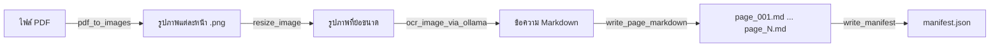

## Task
### Create Unit Tests for [ingestion.py](ingestion.py)

### Planning
 - [/] Read [ingestion.py](ingestion.py) to identify all testable functions
 - [/] Review existing test patterns in [tests/](tests/) directory
 - [/] Write implementation plan
 - [/] Get user approval

### Execution
 - [/] Create [tests/test_ingestion.py](tests/test_ingestion.py) with unit tests for:
    - [/] now_iso_bkk()
    - [/] ensure_dir()
    - [/] slugify_filename()
    - [/] sha1_of_file()
    - [/] list_pdfs()
    - [/] pdf_to_images()
    - [/] resize_image()
    - [/] ocr_image_via_ollama()
    - [/] write_page_markdown()
    - [/] write_manifest()
    - [/] ingest_pdf()
    - [/] main()

## Process [ingestion.py](ingestion.py)

> PDF → Images (per page) → OCR (Ollama Typhoon) → Markdown per page + manifest.json

## ภาพรวม (Overview)

โมดูลนี้ทำหน้าที่นำเข้าเอกสาร PDF โดยแปลงแต่ละหน้าเป็นรูปภาพ จากนั้นทำ OCR ผ่าน Ollama vision model (เช่น `scb10x/typhoon-ocr1.5-3b`) แล้วบันทึกข้อความที่สกัดได้เป็นไฟล์ Markdown แต่ละหน้า พร้อม `manifest.json` สรุปผล

This module ingests PDF documents by rendering each page to an image, performing OCR via an Ollama vision model (e.g. `scb10x/typhoon-ocr1.5-3b`), and saving the extracted text as per-page Markdown files with a `manifest.json` summary.

## ขั้นตอนการทำงาน (Pipeline)



## ไลบรารีที่ใช้ (Dependencies)

| แพ็กเกจ | การใช้งาน |
|---|---|
| `fitz` (PyMuPDF) | แปลงหน้า PDF เป็นรูปภาพ |
| `Pillow` (PIL) | ย่อขนาดรูปภาพก่อนทำ OCR |
| `ollama` | เชื่อมต่อ Ollama API สำหรับ OCR |
| `requests` | เครื่องมือ HTTP |
| `python-dotenv` | โหลดค่าตั้งค่าจากไฟล์ `.env` |

## ฟังก์ชัน (Functions)

### ฟังก์ชันยูทิลิตี้ (Utility Functions)

#### `now_iso_bkk() → str`
คืนค่า timestamp ปัจจุบันในรูปแบบ ISO 8601 ตามเขตเวลากรุงเทพฯ (`+07:00`)

Returns the current timestamp in ISO 8601 format with Bangkok timezone (`+07:00`).

#### `ensure_dir(path: str) → None`
สร้างไดเรกทอรี (รวมถึงไดเรกทอรีแม่) ถ้ายังไม่มี ใช้ `os.makedirs(..., exist_ok=True)` ภายใน

Creates a directory (and parents) if it doesn't exist. Wraps `os.makedirs(..., exist_ok=True)`.

#### `slugify_filename(name: str) → str`
แปลงชื่อไฟล์ให้ปลอดภัยสำหรับ path — ตัดส่วนไดเรกทอรีและนามสกุลออก แล้วแทนที่อักขระพิเศษด้วย underscore รองรับอักขระ Unicode (เช่น ภาษาไทย)

Converts a filename to a safe slug — strips the directory path and extension, then replaces non-word characters with underscores. Preserves Unicode characters (e.g. Thai).

#### `sha1_of_file(path: str) → str`
คำนวณ SHA-1 hash ของไฟล์ ใช้สำหรับสร้าง document ID ที่ไม่ซ้ำกัน

Calculates the SHA-1 hash of a file. Used to generate unique document IDs.

---

### 1. PDF → รูปภาพ (PDF → Images)

#### `list_pdfs(input_dir: str) → List[str]`
ค้นหาไฟล์ `.pdf` ทั้งหมดในไดเรกทอรี (รวมไดเรกทอรีย่อย) แล้วคืนค่ารายการ path ที่เรียงลำดับแล้ว

Recursively walks `input_dir` and returns a sorted list of all `.pdf` file paths.

#### `pdf_to_images(pdf_path, out_dir, dpi=300, image_format="png") → List[Dict]`
แปลงแต่ละหน้าของ PDF เป็นรูปภาพโดยใช้ PyMuPDF

Renders each page of a PDF to an image using PyMuPDF.

**ค่าที่คืน (Returns):** รายการ dict:
```json
[{"page": 1, "image_path": "...", "width": 2550, "height": 3300}]
```

---

### 2. OCR (Ollama Typhoon)

#### `resize_image(image_path, max_dim=1024) → str`
ย่อขนาดรูปภาพให้ด้านที่ยาวที่สุด ≤ `max_dim` ถ้าไม่ต้องย่อจะคืนค่า path เดิม ถ้าย่อจะบันทึกสำเนาที่มี suffix `_resized`

Resizes an image so the longest side ≤ `max_dim`. Returns the original path if no resize needed, otherwise saves a `_resized` copy.

#### `ocr_image_via_ollama(image_path, model, ollama_url, timeout_sec=120) → str`
ส่งรูปภาพที่เข้ารหัส base64 ไปยัง Ollama chat API เพื่อสกัดข้อความ OCR คืนค่าข้อความในรูปแบบ Markdown

Sends a base64-encoded image to the Ollama chat API for OCR extraction. Returns the extracted text as Markdown.

**พารามิเตอร์ (Parameters):**
| พารามิเตอร์ | ค่าเริ่มต้น | คำอธิบาย |
|---|---|---|
| `image_path` | — | เส้นทางไฟล์รูปภาพ (Path to image file) |
| `model` | `$OLLAMA_MODEL` | ชื่อโมเดล Ollama (Ollama model name) |
| `ollama_url` | `$OLLAMA_URL` หรือ `http://localhost:11434` | URL ของเซิร์ฟเวอร์ Ollama |
| `timeout_sec` | `120` | หมดเวลาคำขอเป็นวินาที (Request timeout in seconds) |

**ตัวแปรสภาพแวดล้อม (Environment variables)** ที่ใช้สำหรับตั้งค่าโมเดล:
`temperature`, `top_p`, `repeat_penalty`, `top_k`, `max_tokens`

---

### 3. Markdown และ Manifest

#### `write_page_markdown(output_path, text, metadata: Dict) → None`
บันทึกผลลัพธ์ OCR เป็นไฟล์ Markdown พร้อม HTML comment header ที่มี metadata (ไฟล์ต้นทาง, หมายเลขหน้า, โมเดล ฯลฯ)

Saves OCR output as a Markdown file with an HTML comment header containing metadata (source file, page number, model, etc.).

#### `write_manifest(out_path, manifest: Dict) → None`
เขียน manifest dictionary เป็น JSON แบบจัดรูปแบบสวยงาม พร้อม `ensure_ascii=False` (รองรับภาษาไทย)

Writes the manifest dictionary as pretty-printed JSON with `ensure_ascii=False`.

---

### 4. ฟังก์ชันหลัก (Orchestration)

#### `ingest_pdf(pdf_path, output_root, model, dpi=300, ollama_url, sleep_sec=0.0) → Dict`
นำเข้า PDF ทั้งกระบวนการตั้งแต่ต้นจนจบ:
1. คำนวณ SHA-1 hash → สร้าง `doc_id`
2. แปลงทุกหน้าเป็นรูปภาพผ่าน `pdf_to_images`
3. ทำ OCR แต่ละรูปภาพ (พร้อมการลองใหม่ด้วยขนาดเล็กลงเมื่อเจอ GGML errors)
4. เขียนไฟล์ `page_XXX.md`
5. เขียน `manifest.json`

**กลยุทธ์การลองใหม่ (Retry strategy):** เมื่อเจอ `GGML_ASSERT` errors จะลองใหม่ด้วยรูปภาพที่เล็กลงตามลำดับ: ต้นฉบับ → 1024px → 768px → 512px

**ค่าที่คืน (Returns):** manifest dict ที่มี `doc_id`, `pages`, `errors`, `pages_ok`, `pages_error` ฯลฯ

#### `main()`
จุดเริ่มต้น CLI รับ arguments แล้วเรียก `ingest_pdf` สำหรับแต่ละ PDF ที่พบ

CLI entry point. Parses arguments and calls `ingest_pdf` for each PDF found.

```bash
python ingestion.py --input ./media --output ./data/raw --model scb10x/typhoon-ocr1.5-3b --dpi 150
```

**อาร์กิวเมนต์ CLI (CLI Arguments):**
| อาร์กิวเมนต์ | ค่าเริ่มต้น | คำอธิบาย |
|---|---|---|
| `--input` | `./media` | ไดเรกทอรีที่มีไฟล์ PDF (Input directory with PDFs) |
| `--output` | `./data/raw` | ไดเรกทอรีผลลัพธ์ (Output root directory) |
| `--model` | `$OLLAMA_MODEL` | ชื่อโมเดล Ollama |
| `--ollama_url` | `$OLLAMA_URL` | URL เซิร์ฟเวอร์ Ollama |
| `--dpi` | `150` | ความละเอียดในการแปลงรูปภาพ (Image rendering DPI) |
| `--timeout` | `120` | หมดเวลา OCR เป็นวินาที (OCR timeout in seconds) |
| `--sleep_sec` | `0.0` | หน่วงเวลาระหว่างหน้า (Delay between pages) |

## โครงสร้างผลลัพธ์ (Output Structure)

```
data/raw/
└── {slug}_{sha1[:8]}/
    ├── manifest.json
    ├── images/
    │   ├── page_001.png
    │   ├── page_002.png
    │   └── ...
    └── pages_md/
        ├── page_001.md
        ├── page_002.md
        └── ...
```

## การทดสอบ (Unit Tests)

ดูที่ [tests/test_ingestion.py](tests/test_ingestion.py) และ [tests/test_ingestion.md](tests/test_ingestion.md) — 36 เทสครอบคลุมทุกฟังก์ชัน

See [tests/test_ingestion.py](tests/test_ingestion.py) and [tests/test_ingestion.md](tests/test_ingestion.md) — 36 tests covering all functions.
